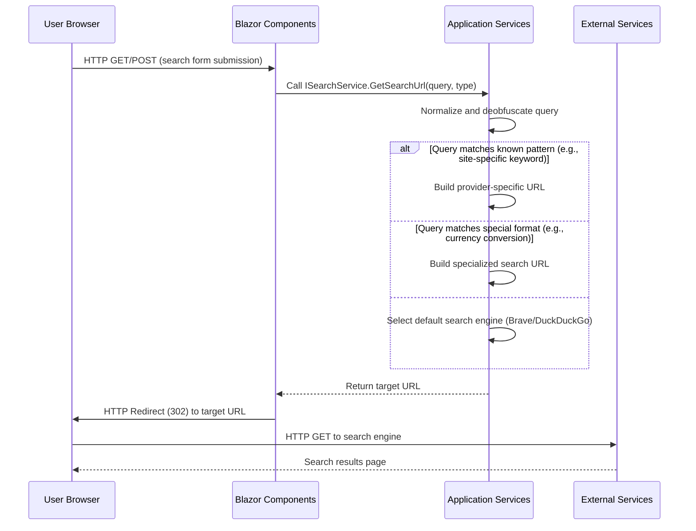
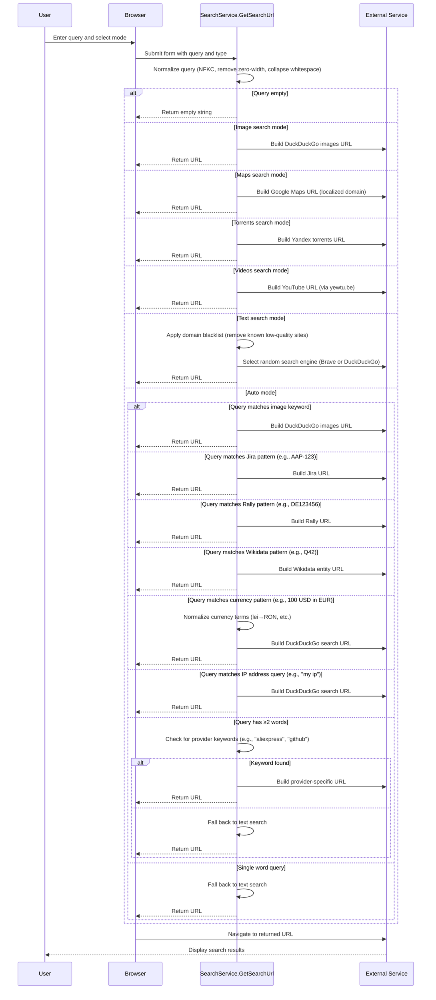
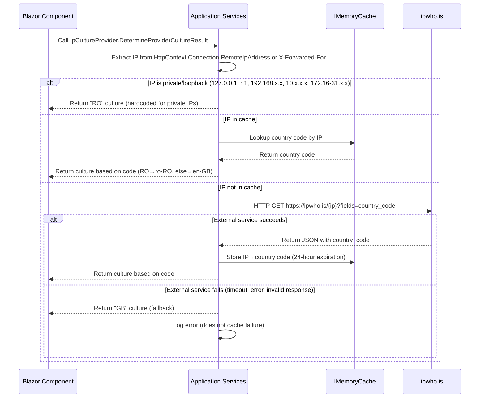

# NuciSearch Architecture

This document describes the current architecture of the NuciSearch search wrapper application.

## 📑 Table of Contents
- [Purpose](#-purpose)
- [System Context](#-system-context)
- [Architectural Style](#-architectural-style)
- [Runtime Flow](#-runtime-flow)
- [Architectural Areas](#-architectural-areas)
  - [Presentation](#presentation)
  - [Application](#application)
- [Data Architecture](#-data-architecture)
- [Interfaces and Integrations](#-interfaces-and-integrations)
- [Key Flows](#-key-flows)
  - [Query Processing Flow](#query-processing-flow)
  - [Geolocation Lookup Flow](#geolocation-lookup-flow)
- [Cross-Cutting Concerns](#-cross-cutting-concerns)
  - [Security and Privacy](#security-and-privacy)
  - [Error Handling](#error-handling)
  - [Observability](#observability)
  - [Configuration](#configuration)
  - [Concurrency and Resource Use](#concurrency-and-resource-use)
- [Dependency Direction and Rules](#-dependency-direction-and-rules)
- [External Dependencies](#-external-dependencies)
- [Deployment and Operations](#-deployment-and-operations)
- [Compatibility Contracts](#-compatibility-contracts)
- [Testing and Verification](#-testing-and-verification)
- [Design Constraints](#-design-constraints)
- [Extension Points](#-extension-points)
  - [Search Service Extension](#search-service-extension)
  - [Geolocation Service Extension](#geolocation-service-extension)
  - [Localization Extension](#localization-extension)
- [Source Map](#-source-map)
- [Related Documentation](#-related-documentation)

## 🎯 Purpose
NuciSearch is a lightweight self-hosted search wrapper that routes a query to an appropriate specialised engine based on the selected mode and query pattern. The architecture is designed to be modular, maintainable, and extensible for adding new search providers or modifying routing logic. The primary audience is developers and operators who wish to understand, modify, or deploy the application.

## 🌐 System Context
The NuciSearch application is a web application that receives HTTP requests from users via a browser. It processes search queries and redirects users to external search engines or specialized sites based on the query type and user-selected mode. The system interacts with external search providers (e.g., DuckDuckGo, Google, Brave, YouTube) and geolocation services (ipwho.is) to determine user locale. There are no persistent data stores; state is held in memory (caching) or derived from requests.

```mermaid
flowchart LR
    subgraph NuciSearch[NuciSearch Application]
        direction TB
        Presentation[Presentation Layer<br/>(Blazor Components)]
        Application[Application Layer<br/>(Services, Localisation, Logging)]
    end
    subgraph External[External Systems]
        direction TB
        SearchEngines[Search Engines<br/>(DuckDuckGo, Google, etc.)]
        Geolocation[Geolocation Service<br/>(ipwho.is)]
    end
    User[User Browser] -->|HTTP Request| Presentation
    Presentation -->|Service Calls| Application
    Application -->|HTTP Requests| SearchEngines
    Application -->|HTTP Requests| Geolocation
```

The principal external boundaries are:
- **Search Engines:** Outbound HTTP requests to various search APIs (DuckDuckGo, Google, Brave, YouTube, etc.) to perform searches based on user queries.
- **Geolocation Service:** Outbound HTTP request to ipwho.is to determine country code from IP address for localization purposes.

## 🏗️ Architectural Style
NuciSearch follows a layered architectural style with clear separation of concerns between presentation, application logic, and infrastructure concerns. The application uses dependency injection to manage service lifetimes and promote testability. The Blazor framework provides a component-based UI architecture with server-side rendering.

```mermaid
flowchart LR
    subgraph NuciSearch[NuciSearch Application]
        direction TB
        subgraph Presentation[Presentation Layer]
            Components[Blazor Components<br/>(Pages, Layouts)]
        end
        subgraph Application[Application Layer]
            Services[Search Service<br/>(Query Routing)]
            Geolocation[Geolocation Service<br/>(Country Detection)]
            Localisation[Localisation Provider<br/>(Culture Selection)]
            Logging[Logging Definitions<br/>(Keys and Operations)]
        end
    end
    subgraph ExternalDeps[External Dependencies]
        NuciLog[NuciLog<br/>(Logging Infrastructure)]
        NuciText[NuciText.Obfuscation<br/>(Query Obfuscation)]
        HttpClient[IHttpClientFactory<br/>(HTTP Client)]
        MemoryCache[IMemoryCache<br/>(Caching)]
    end
    Presentation -->|Uses| Application
    Application -->|Depends on| ExternalDeps
```

The principal architecture boundaries are:
- **Presentation Layer:** Handles UI rendering and user input; depends only on Application layer.
- **Application Layer:** Contains business logic for search routing, geolocation, and localization; depends on external dependencies (NuciLog, NuciText.Obfuscation, HttpClientFactory, IMemoryCache).
- **External Dependencies:** Third-party libraries providing cross-cutting concerns (logging, obfuscation) and fundamental capabilities (HTTP client, caching).

## 🔄 Runtime Flow


The principal runtime sequence is:
1. User submits search form or navigates with query string
2. Blazor component extracts query and search type, calls ISearchService
3. Application service normalizes query, applies obfuscation, checks for special patterns
4. Service constructs appropriate target URL based on search type and query analysis
5. Component redirects user to target URL
6. User's browser requests search results from external service
7. External service returns search results to user

## 🗂️ Architectural Areas
### Presentation
Paths:
- `NuciSearch/Components/Pages`
- `NuciSearch/Components/Layout`
- `NuciSearch/Components/App.razor`
- `NuciSearch/Components/Routes.razor`
Responsibilities:
- Render user interface for search input and mode selection
- Handle form submission and navigation
- Extract query string parameters for automatic redirection
Boundary rules:
- Depends on Application layer (ISearchService, IStringLocalizer)
- Does not depend on Infrastructure or external dependencies directly
- May not invoke Application layer services during prerendering (protected by IsFirstRender check)

### Application
Paths:
- `NuciSearch/Services`
- `NuciSearch/Localisation`
- `NuciSearch/Logging`
Responsibilities:
- Implement search query routing logic (GetSearchUrl method)
- Provide geolocation lookup for localization (IGeolocationService)
- Define logging keys and operations (NuciSearchLogInfoKey, NuciSearchOperation)
- Provide IP-based culture provider (IpCultureProvider)
Boundary rules:
- Depends on External Dependencies (NuciLog, NuciText.Obfuscation, Microsoft.Extensions.Caching.Memory, System.Net.Http.Json)
- Does not depend on Presentation layer
- Services are registered as singletons (except scoped HttpClient handlers)
- Localisation provider is singleton; caching uses IMemoryCache (singleton)

## 💾 Data Architecture
NuciSearch does not persist meaningful state beyond the lifetime of a request. The application uses in-memory caching for geolocation lookups to reduce external API calls. All data transformations are performed on request-specific data.

```mermaid
flowchart LR
    UserInput[User Query<br/>(HTTP Request)] -->|Normalize| NormalizedQuery[Normalized Query<br/>(Trimmed, deobfuscated)]
    NormalizedQuery -->|Pattern Match| PatternMatch[Detected Pattern<br/>(e.g., Jira ID, currency)]
    PatternMatch -->|URL Construction| TargetURL[Target Search URL]
    TargetURL -->|Redirect| Browser[User Browser]
    IPAddress[Client IP Address] -->|Geolocation Lookup| CountryCode[Country Code<br/>(Cached)]
    CountryCode -->|Culture Selection| Culture[.NET CultureInfo<br/>(en-GB or ro-RO)]
    Culture -->|Localization| Resources[Localized Strings<br/>(.resx files)]
```

| Data or Store | Owner | Representation and Storage | Lifecycle or Consistency |
|---------------|-------|----------------------------|--------------------------|
| `Geolocation Cache` | Geolocation Service | IP address → country code (string) in `IMemoryCache` | Inserted on cache miss; expired after 24 hours; consistent within cache lifetime |
| `Query String` | Presentation Layer | Plain text in HTTP request/query string | Valid for single request; not stored |
| `Localized Strings` | Application Layer | Key-value pairs in `.resx` files (SharedResources.resx, SharedResources.ro-RO.resx) | Loaded at startup; immutable during runtime |
| `Obfuscation Mapping` | Search Service | Character substitution map in `NuciText.Obfuscator` | Loaded at type initialization; immutable |

## 🔌 Interfaces and Integrations
| Interface or Integration | Direction | Contract | Owner | Failure Semantics |
|--------------------------|-----------|----------|-------|-------------------|
| `ISearchService` | Inbound | Method `string GetSearchUrl(string rawQuery, string searchType)` | Application Layer (SearchService) | Throws exception on unexpected failure; caller handles via try/catch in SearchService.GetSearchUrl |
| `IGeolocationService` | Inbound | Method `Task<string> GetCountryCodeAsync(string ipAddress)` | Application Layer (GeolocationService) | Returns default "GB" on failure; logs error but does not propagate exception |
| `IpCultureProvider` | Inbound | Implements `IRequestCultureProvider.DetermineProviderCultureResult` | Application Layer (Localisation) | Returns "en-GB" culture on failure; logs error but does not propagate exception |
| `NuciLog` | Outbound | Logging via `ILogger` methods (Info, Error, etc.) | External Dependency (NuciLog.Core) | Logging failures are swallowed by NuciLog; application continues |
| `Search Engines` | Outbound | HTTP GET to search endpoints with query parameters | External Systems (DuckDuckGo, Google, etc.) | Navigation failure results in browser error page; no retry logic |
| `ipwho.is` | Outbound | HTTP GET to `https://ipwho.is/{ip}?fields=country_code` | External Service (ipwho.is) | Returns default "GB" on failure; caches failure for 24 hours? (Actually caches only successful lookups) |

## 🔀 Key Flows
### Query Processing Flow


### Geolocation Lookup Flow


## 🧵 Cross-Cutting Concerns
### Security and Privacy
- The application does not collect, store, or transmit personal data beyond what is necessary for the immediate request.
- IP addresses are used solely for geolocation to determine locale and are not stored long-term (cached for 24 hours only).
- Query obfuscation is applied via NuciText.Obfuscation to prevent certain tracking or fingerprinting techniques before logging.
- No authentication or authorization is required; the service is openly accessible.
- Error handling avoids leaking stack traces or internal details to users; generic error pages are shown.

### Error Handling
- Failures in external service calls (geolocation, search engine availability) are caught and logged.
- Geolocation service failures fall back to default "GB" country code, resulting in English localization.
- Search service failures (e.g., malformed URLs) are logged and re-thrown; Blazor middleware catches unhandled exceptions and shows error page.
- Logging infrastructure (NuciLog) is configured to write to file and console; failures in logging do not affect core functionality.
- The application uses ASP.NET Core's built-in exception handling middleware in non-development environments.

### Observability
- Structured logging is implemented via NuciLog with custom LogInfoKey and Operation types.
- Key operations logged: Search (with query, search type, and result URL) and GetCountryCode (with IP address and result).
- Log levels: Default "Information", Microsoft.AspNetCore limited to "Warning".
- No metrics, traces, or health checks are currently implemented.
- Diagnostic gaps: No visibility into search latency, error rates from external services, or cache hit/miss ratios for geolocation.

### Configuration
| Configuration Area | Source | Responsibility | Override or Secret Policy |
|--------------------|--------|----------------|---------------------------|
| Logging Log Levels | appsettings.json | Minimum log level for Microsoft.Extensions.Logging | Overridden by environment variables (e.g., Logging:LogLevel:Default=Debug) |
| NuciLoggerSettings | appsettings.json | File path and toggle for NuciLog file output | Overridden by environment variables; no secrets involved |
| Allowed Hosts | appsettings.json | Host header validation | Overridden by environment variables; default "*" allows all |
| ASPNETCORE_ENVIRONMENT | Environment | Determines development vs. production behavior | Set at startup; affects exception page display and caching |

### Concurrency and Resource Use
- The application is stateless per request; concurrent requests do not share mutable state.
- Geolocation service uses `IMemoryCache` with thread-safe reads/writes; cache entries are immutable after insertion.
- HttpClientFactory creates HttpClient instances that are safe for concurrent use.
- Blazor Server processes each connection sequentially; no parallelism within a single circuit.
- Memory usage is limited by cache size (geolocation entries) and request scope; no evidence of memory leaks.
- No explicit resource limits or backpressure mechanisms; relies on ASP.NET Core's thread pool and queueing.

## 🧭 Dependency Direction and Rules
Dependencies flow inward: Presentation → Application → External Dependencies. No circular dependencies exist. The Application layer depends on abstractions where possible (e.g., IGeolocationService, ILogger) but uses concrete implementations for framework-provided services (HttpClientFactory, IMemoryCache).

```mermaid
flowchart TD
    subgraph NuciSearch[NuciSearch Application]
        direction TB
        subgraph Pres[Presentation Layer]
            Components[Blazor Components]
        end
        subgraph App[Application Layer]
            Services[Search Service<br/>(ISearchService)]
            Geolocation[Geolocation Service<br/>(IGeolocationService)]
            Localisation[Localisation Provider<br/>(IpCultureProvider)]
            Logging[Logging Definitions]
        end
    end
    subgraph ExtDeps[External Dependencies]
        NuciLog[NuciLog<br/>(ILogger)]
        NuciText[NuciText.Obfuscation<br/>(IObfuscator)]
        HttpClient[IHttpClientFactory]
        MemoryCache[IMemoryCache]
    end
    Pres -->|Depends on| App
    App -->|Depends on| ExtDeps
    style ExtDeps fill:#f9f,stroke:#333,stroke-width:2px
```

The principal dependency rules are:
- Presentation layer may only depend on Application layer interfaces (e.g., ISearchService, IStringLocalizer).
- Application layer may depend on external dependencies but must not depend on Presentation layer.
- External dependencies (Nuget packages) are permitted; direct calls to specific implementations should be avoided where abstractions exist.
- No component may depend on itself (no circular dependencies).

## 📦 External Dependencies
| Dependency | Responsibility | Integration Boundary | Architectural Consequence |
|------------|----------------|----------------------|---------------------------|
| `NuciLog` | Logging infrastructure (file and console logging) | Application Layer (via `ILogger` and `NuciLoggerSettings`) | Provides structured logging with custom keys and operations; enables file-based logging configuration |
| `NuciText.Obfuscation` | String obfuscation for query logging | Application Layer (via `INuciTextObfuscator`) | Prevents sensitive data leakage in logs by obfuscating queries before logging |
| `Microsoft.Extensions.Caching.Abstractions` | Memory caching abstractions | Application Layer (via `IMemoryCache`) | Enables efficient geolocation lookups with expiration policies |
| `System.Net.Http.Json` | HTTP client JSON extensions | Application Layer (via `HttpClient.GetFromJsonAsync`) | Simplifies calling REST APIs that return JSON (used for ipwho.is) |
| `Microsoft.AspNetCore.Components.Web` | Blazor Server framework | Presentation Layer (via `AddRazorComponents`, `AddInteractiveServerRenderMode`) | Provides UI framework, routing, and component model |
| `Microsoft.AspNetCore.Localization` | Middleware for request localization | Application Layer (via `UseRequestLocalization`) | Enables culture selection based on IP address via custom provider |

## 🚀 Deployment and Operations
NuciSearch is deployed as a self-contained ASP.NET Core web application targeting .NET 10.0. The deployment unit is a compiled set of DLLs and static assets. The application is stateless except for in-memory caching, which is local to each instance. Horizontal scaling requires shared sticky sessions or external cache for geolocation data to maintain consistency across instances.

| Concern | Current Design | Architectural Consequence |
|---------|----------------|---------------------------|
| Process topology | Single process handling HTTP requests via Kestrel | Each instance manages its own cache; geolocation results may differ between instances until cache warms up |
| Persistent state | None (in-memory cache only) | No need for persistent storage; simplifies deployment and backup |
| Filesystem or network requirements | Outbound HTTP to search engines and ipwho.is; inbound HTTP on configured port | Requires outbound internet access; inbound port must be accessible to users |
| Scaling assumptions | Stateless frontend; cache is local to instance | Horizontal scaling behind load balancer may cause cache misses until each instance warms up; consider distributed cache for production |
| Startup responsibilities | Build web host, configure services, apply middleware | Startup time includes NuciLog initialization and dependency resolution |
| Shutdown responsibilities | Graceful termination of pending requests | No special shutdown logic; hosted service lifetime managed by ASP.NET Core |
| Operator-visible outputs | Logs to console and configured file; HTTP responses | Logs provide visibility into query patterns and geolocation lookups; no metrics endpoint |

## 🛡️ Compatibility Contracts
| Contract | Owner | Invariant | Verification | Change Policy |
|----------|-------|-----------|--------------|---------------|
| OpenSearch Description Format | Application Layer (`/opensearch.xml` endpoint) | XML document adhering to OpenSearch 1.1 schema with `ShortName`, `Description`, `Url` template | Manual verification; unit test in SearchServiceTests for OpenSearch URL generation | Must remain backward compatible; changes require version bump in OpenSearch specification |
| Query String Handling (`q` parameter) | Presentation Layer (Home.razor) | Parameter `q` in query string triggers automatic redirect if non-empty | Manual verification; integration test via browser automation | Should remain stable; changes would break browser integration and bookmarklets |
| Search Service Interface (`ISearchService.GetSearchUrl`) | Application Layer | Method returns string URL or empty string; never returns null | Unit tests in SearchServiceTests; null reference analysis | Changes must preserve method signature and null-safety; new search types should be additive |
| Geolocation Service Interface (`IGeolocationService.GetCountryCodeAsync`) | Application Layer | Method returns Task<string> representing country code; never returns null | Unit tests (implicit via IpCultureProvider); code review | Changes must preserve Task return type and string result; failure handling should remain consistent |

## ✅ Testing and Verification
The architecture is verified through unit tests covering service logic and integration tests via manual verification. The test project (NuciSearch.UnitTests) focuses on the SearchService behavior under various inputs.

Execute the principal automated verification with:

```bash
dotnet test NuciSearch.UnitTests
```

This verifies:
- Search service routing logic for all supported modes (auto, text, images, torrents, videos, maps)
- Keyword-based routing (e.g., "wikidata", "github", "aliexpress")
- Special format handling (currency conversion, IP address queries, Jira/Rally patterns)
- Edge cases (empty queries, whitespace, obfuscation, normalization)
- Culture-specific behavior (en-GB vs ro-RO for maps and wikipedia)
- Failure handling (malformed inputs, service exceptions)

Manual verification includes:
- Browser testing of search form submission and redirect
- OpenSearch integration test via browser search bar
- Geolocation behavior testing (using headers to simulate different IPs)
- Build and deployment verification via release.sh script

Material coverage gaps:
- No automated tests for Blazor component interaction (reliant on manual verification)
- No tests for middleware components (UseRequestLocalization, UseExceptionHandler)
- No performance or load testing
- No contract tests for external service APIs (reliant on runtime monitoring)

## ⚠️ Design Constraints
- **External Service Reliance:** Dependence on third-party search engines and ipwho.is means functionality degrades if these services change or become unavailable; mitigated by fallback search engines and hardcoded defaults.
- **Statelessness:** Lack of persistent storage limits features like user history or preferences; mitigated by browser-local storage (not implemented) or URL-based state (query string).
- **Blazor Server Model:** Requires persistent SignalR connection; increases memory usage per user and complicates horizontal scaling; mitigated by low expected user count and short session durations.
- **Localization Scope:** Only two cultures supported (en-GB, ro-RO); adding new cultures requires resource files and IpCultureProvider updates.
- **Obfuscation Limitations:** NuciText.Obfuscation provides basic character substitution; may not prevent all fingerprinting techniques.

## 🔧 Extension Points
### Search Service Extension
1. Implement or revise the `ISearchService` interface to add new search modes or modify routing logic.
2. Register the implementation in `ServiceCollectionExtensions.AddNuciSearchServices` (replace or add to existing registration).
3. Add unit tests in `NuciSearch.UnitTests.Services` to verify new behavior and ensure existing contracts are preserved.

The extension must preserve the method signature and null-safety contract of `ISearchService.GetSearchUrl`. It should not introduce blocking operations or external dependencies without proper error handling.

### Geolocation Service Extension
1. Implement or revise the `IGeolocationService` interface to use different geolocation providers or add caching strategies.
2. Register the implementation in `ServiceCollectionExtensions.AddNuciSearchServices`.
3. Add tests to verify behavior under various IP addresses and failure scenarios.

The extension must preserve the asynchronous nature and return type of `GetCountryCodeAsync`. It should handle private IP addresses consistently and provide reasonable fallback values.

### Localization Extension
1. Add new resource files for additional cultures (e.g., `SharedResources.fr-FR.resx`).
2. Update `IpCultureProvider` to map additional country codes to new cultures.
3. Update `Program.cs` to include new cultures in `supportedCultures` array.

The extension must preserve the existing cultures (en-GB, ro-RO) and ensure resource files are properly formatted. Missing resources will fall back to default culture.

## 🗺️ Source Map

| Area | Path |
|------|------|
| Solution Root | `NuciSearch.slnx` |
| Main Application | `NuciSearch/` |
| Presentation Layer | `NuciSearch/Components/` |
| Application Layer | `NuciSearch/Services/`, `NuciSearch/Localisation/`, `NuciSearch/Logging/` |
| Resources | `NuciSearch/Resources/` |
| Static Assets | `NuciSearch/wwwroot/` |
| Unit Tests | `NuciSearch.UnitTests/` |
| Test Services | `NuciSearch.UnitTests/Services/` |

## 📚 Related Documentation
- [README.md](README.md) - Overall project overview, usage instructions, and development guidelines
- [ROADMAP.md](ROADMAP.md) - Planned features and evolution of the project
- [release.sh](release.sh) - Automated release script for publishing new versions